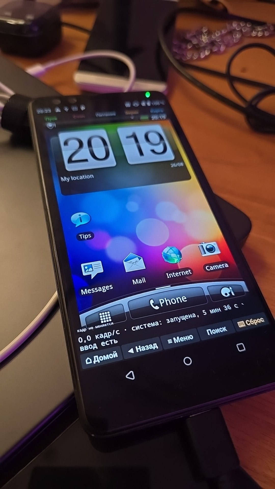

Sense 2.1 - Desire HD

«HTC Sense 2.1 emulator for modern Android devices»

The emulator runs the original HTC Desire HD firmware with a minimal compatibility layer required for it to work.

In simple terms, it works like having a second phone inside your Android device.

---

✦ Features

Feature| Support
HTC Sense 2.1| ✓
Original Desire HD Firmware| ✓
Accelerometer| ✓
3D Acceleration| ✓
OpenGL ES 1.1| ✓
CPU Rendering| ✓
GPU Rendering| ✓

---

⚙ CPU & GPU Modes

The emulator supports two rendering modes:

"CPU"

Software-based rendering.

«Recommended for devices with Mali GPUs.
CPU mode can provide smoother performance and reduce lag on some Mali-based devices.»

"GPU"

Hardware-accelerated rendering using the device's GPU.

«Performance may vary depending on the GPU and driver.»

---

  Installing Games

1. Copy the game

Place the game directly inside the:

DesireHd

folder.

2. Launch the emulator

Start the emulator and wait for the Desire HD environment to boot.

3. Open ES File Explorer

Inside the emulated system, open:

ES File Explorer

Find your game and launch it.

«IMPORTANT: The game must be placed specifically in the "DesireHd" folder.»

---

 First Boot

The emulator may not boot successfully on the first attempt.

It can take approximately 2 attempts to start correctly.

Sometimes the emulator may appear to freeze on the HTC logo.

«This is expected behavior.»

Please wait around 2 minutes before closing the emulator.

---

⌨ Known Issues

- Some keyboard input may not work correctly.
- Certain keys may be unresponsive.
- Startup may require multiple attempts.

---

 Hardware Support

The emulator includes support for:

Accelerometer
OpenGL ES 1.1
3D Acceleration
CPU Rendering
GPU Rendering

---

⚠ Disclaimer

«This project is experimental.
Performance, compatibility, and stability may vary depending on the Android device and GPU.»

